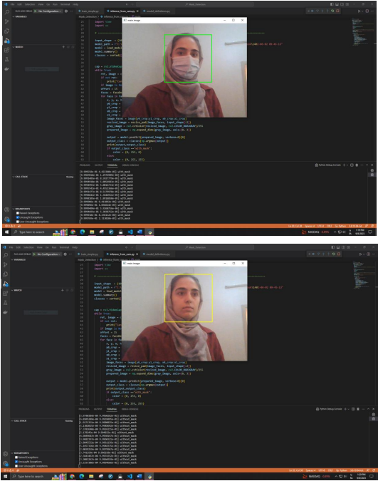

# Face-Mask-Detection
Face Mask Detection using Tensorflow and Keras.
this was my final project for my bachelor's degree.
I did all the work from gathering the data to writing the training script.
For now I'm only publishing the final results.
the training scripts and the dataset are going to be published soon.

### output of the model:

-Zahra
